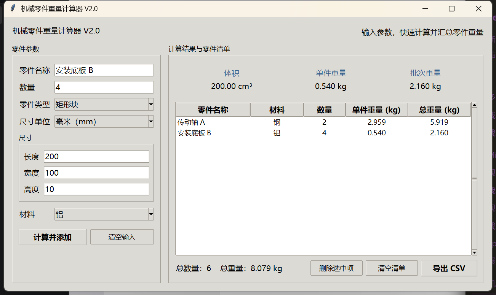

# 机械零件重量计算器 V2.1

[](https://github.com/xingtao47/mechanical-part-weight-calculator/actions/workflows/tests.yml)

一个可离线使用的 Windows 桌面工具，用于计算常见机械零件的体积、单件重量和批次总重量。

## 下载最新版

**[前往 GitHub Releases 下载 Windows 版本](https://github.com/xingtao47/mechanical-part-weight-calculator/releases/latest)**

在最新 Release 的 Assets 区域下载 `机械零件重量计算器-V2.1.zip`，完整解压后双击 EXE 即可使用，不需要安装 Python。

## 软件界面



## 系统要求

- 面向 64 位 Windows 10 和 Windows 11。
- 使用 EXE 时不需要安装 Python。
- 软件完全离线运行，不上传或收集输入的数据。
- EXE 尚未进行商业代码签名。Windows 首次运行时可能显示安全提醒，请先确认文件来自本仓库的正式 Release。

## 使用方法

1. 填写零件名称和数量。
2. 选择零件类型和尺寸单位。
3. 输入尺寸并选择材料。
4. 点击“计算并添加”。
5. 在右侧查看单件重量、批次重量和零件清单。
6. 需要以后继续处理时点击“保存清单”，生成 `.mpwc` 文件。
7. 下次使用时点击“打开清单”，选择以前保存的 `.mpwc` 文件。
8. 需要用 Excel 查看或分享结果时点击“导出 CSV”。

## 主要功能

- 支持实心圆柱、空心圆柱和矩形块。
- 支持毫米（mm）、厘米（cm）和米（m）。
- 内置钢、铝、铜和钛的常用近似密度。
- 支持输入自定义材料名称和密度。
- 自动检查空心圆柱内径必须小于外径。
- 自动处理空值、文字、零、负数和无效数量。
- 支持连续添加多个零件并汇总总数量和总重量。
- 支持删除选中零件和清空清单。
- 支持保存和重新打开 `.mpwc` 零件清单。
- 支持导出可由 Excel 直接打开的 CSV 文件。
- 保留原有命令行版本。

## 计算公式

实心圆柱体积：

`体积 = π × (直径 ÷ 2)² × 长度`

空心圆柱体积：

`体积 = π × [(外径 ÷ 2)² - (内径 ÷ 2)²] × 长度`

矩形块体积：

`体积 = 长度 × 宽度 × 高度`

零件重量：

`重量 = 体积 × 材料密度`

## 材料密度

- 钢：7.85 g/cm³
- 铝：2.70 g/cm³
- 铜：8.96 g/cm³
- 钛：4.51 g/cm³
- 自定义材料：由用户输入名称和密度

材料密度为常用近似值，实际结果会受到具体牌号和材料状态影响。

## 常见问题

### 双击 EXE 后 Windows 显示安全提醒怎么办？

这是因为当前独立开发版本尚未购买商业代码签名证书。请只从本仓库的正式 Release 下载文件，并在确认来源后决定是否运行。

### 怎样在下次打开软件时继续使用原来的清单？

关闭前点击“保存清单”并妥善保管生成的 `.mpwc` 文件。下次启动软件后点击“打开清单”，选择该文件即可继续使用。CSV 主要用于 Excel 查看和分享，不能代替项目文件。

### 可以在 macOS 或 Linux 上运行吗？

GitHub Release 中的 EXE 只能在 Windows 上运行。Python 源代码可在安装了 Python 和 Tkinter 的其他系统上尝试运行，但目前未作兼容性保证。

### 计算结果可以直接用于设计或采购吗？

软件结果适合估算和辅助核对。正式设计、报价或采购前，请核对实际材料密度、公差和工程要求。

## 反馈问题和建议

- **[报告程序错误](https://github.com/xingtao47/mechanical-part-weight-calculator/issues/new?template=bug_report.yml)**
- **[提出新功能建议](https://github.com/xingtao47/mechanical-part-weight-calculator/issues/new?template=feature_request.yml)**
- 参与开发请阅读 [CONTRIBUTING.md](CONTRIBUTING.md)。

提交截图时，请遮挡用户名、本地文件路径和其他隐私信息。

## 开发者运行方法

需要 Python 3.12 或兼容版本。

运行图形界面：

```powershell
python weight_calculator_gui.py
```

运行原来的命令行版本：

```powershell
python weight_calculator.py
```

运行全部自动测试：

```powershell
python -m unittest -v
```

每次推送到 `main` 或创建 Pull Request 时，GitHub Actions 也会自动运行这些测试。

## 打包 Windows EXE

先安装 PyInstaller：

```powershell
python -m pip install pyinstaller
```

然后在项目文件夹的 PowerShell 终端运行：

```powershell
.\build_exe.ps1
```

打包完成后，EXE 位于 `dist` 文件夹中。

## 版本记录

- V2.1：新增 `.mpwc` 零件清单的保存、打开、格式校验和未保存提醒。
- V2.0：新增 Windows 桌面图形界面、零件清单、弹窗错误提示和“另存为”CSV。
- V1.6：新增 CSV 清单导出和合计行。
- V1.5：新增自定义材料和密度。
- V1.4：新增零件名称、数量、批次重量和汇总清单。
- V1.3：新增矩形块计算。
- V1.2：新增空心圆柱计算和内外径检查。
- V1.1：新增钛材料。
- V1.0：实现实心圆柱重量计算。

完整记录请查看 [CHANGELOG.md](CHANGELOG.md)。

## 许可证

本项目采用 [MIT License](LICENSE)。
